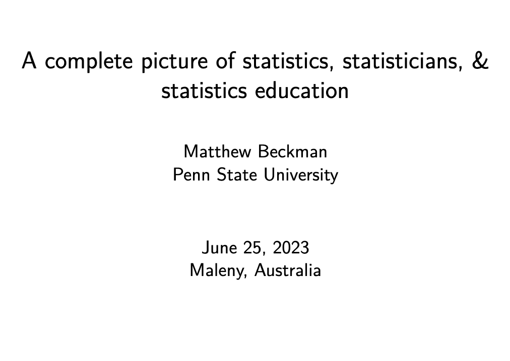
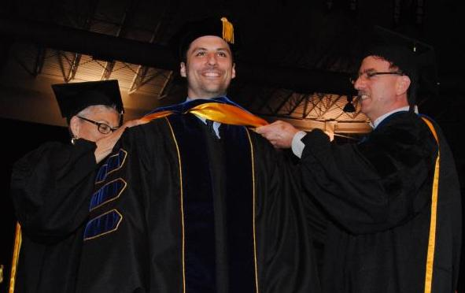

```{r setup, include=FALSE}
knitr::opts_chunk$set(echo = FALSE)

library(tidyverse)
# library(kableExtra)

```


# 

{ width=95% }

# 

{ width=95% }

# 

\titlepage


# Who is this guy anyway?


# The birth of an academic

{ width=40% }

>- if any of you know me, it's probably thanks to my ~~parents~~ PhD advisors Joan & Bob 
>- as it happens, most of my personal history has almost nothing to do with academics!
>- here's a bit of my non-academic upbringing...


# Mum & Dad

{ width=40% }

# 


# Slide 1

- item 1
- item 2

### Box

1. item
2. item


# Slide 2

- Cite stuff people have already done[^1]
- Link to URL's: <https://en.wikipedia.org/wiki/URL>

[^1]: American Statistical Association Undergraduate Guidelines Workgroup (2014). *Curriculum guidelines for undergraduate programs in statistical science.*


# Here's a table

| Col1 | Col2 | 
|:--------------:|:-----------|
| 1 |  One |
| 2 |  Two |
| 3 |  Three |
| 4 |  Four  |
| 5 |  Five  |
| 6 |  Six  |


# Acknowledgments

- So many to thank


# References

\footnotesize

1. American Statistical Association Undergraduate Guidelines Workgroup (2014). 2014 Curriculum guidelines for undergraduate programs in statistical science. Alexandria, VA: American Statistical Association. http://www.amstat.org/education/curriculumguidelines.cfm


# Q & A 


\titlepage


Include URL for gh-pages site for presentation


# Backup slide


