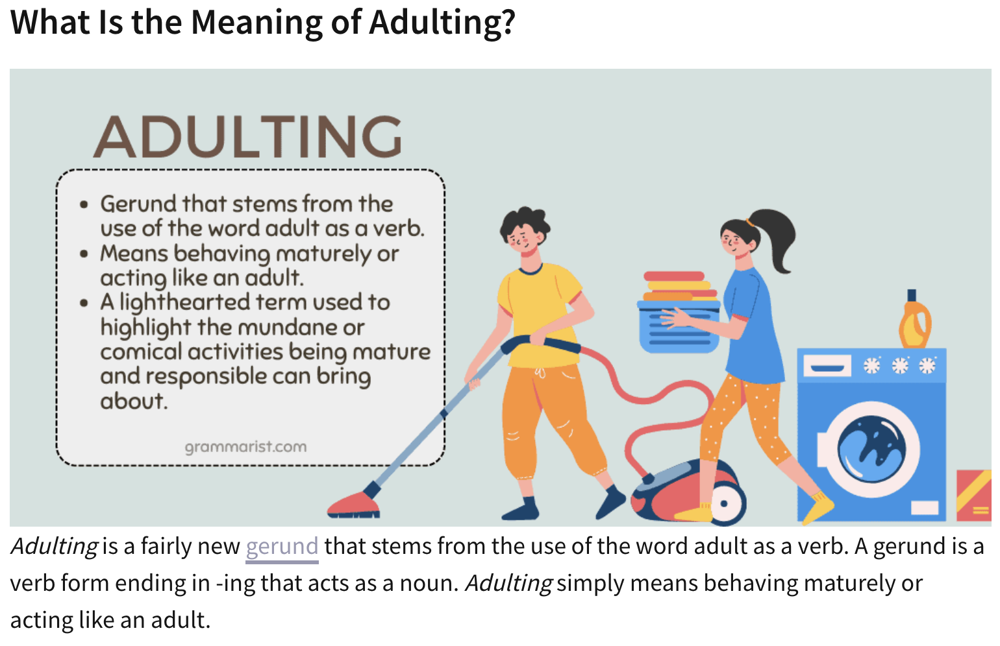
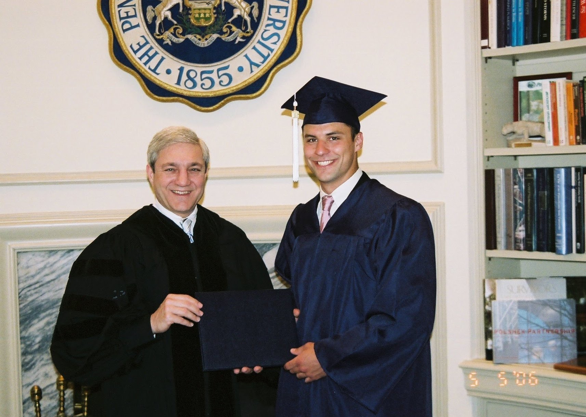
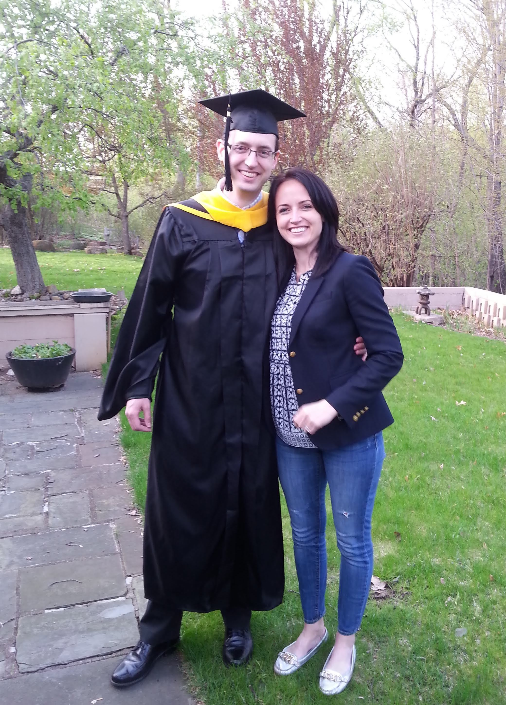
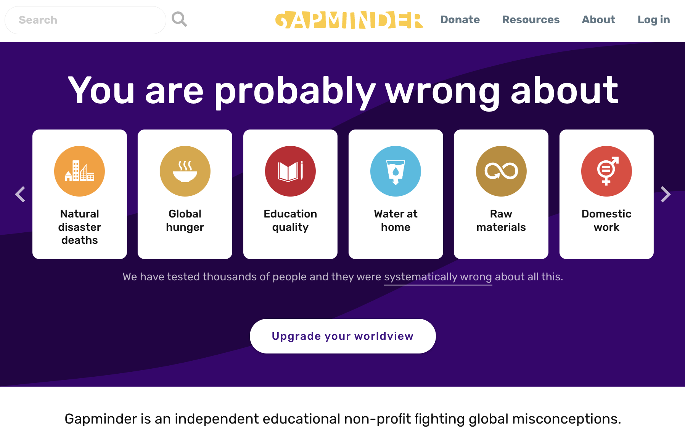
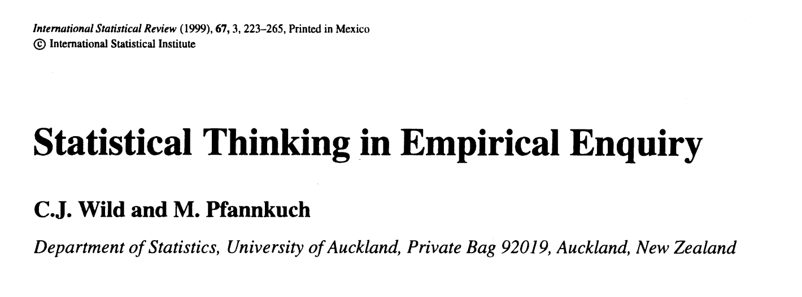

```{r setup, include=FALSE}
knitr::opts_chunk$set(echo = FALSE)

library(tidyverse)
# library(kableExtra)

```


# 

{ width=95% }

# 

{ width=80% }

\small

### 

>- ...on "reconceptualising data and data-ing"
>- "data-ing?"
>- that wasn't in the book... 


# 

\titlepage


# "Data...ing?"

>- I'm usually not one to "verb" my nouns (then use as a gerund)
>- [*checks list of participants for "grammarian-in-residence"*]
>- but I've heard this kind of thing happens on Twitter


# \# ADULTING

{ width=95% }


# But "Data" as a verb?

>- I've heard of *data verbs*, just not "data" *as* a verb

>- Amelia McNamara helpfully pointed out (to my surprise) this too has precedent!

>- Who would do such a thing?

# Jer Thorp

![image credit: Roman Makhmutov[^1] ](thorp.png)

[^1]: Thorp, J. (2021). Living in data: A citizen's guide to a better information future. New York: MCD, Farrar, Straus and Giroux.


# Coming around...

>- "the pair data and data-ing refers to a similar conceptualization of the relation between sample and sampling, or model and modeling, where the first is the statistical concept and the second refers to the process of engaging or reasoning with this concept."

>- *This* resonates with me

>- and it's starting to sound familiar...


# What perspective can I offer?

<!-- I'm deeply honored that I was invited to be this year's statistician in residence. -->

<!-- Past SRTL statisticians in residence like Chris Wild, Allan Rossman, Rob Gould, Nick Horton (and more) are all people that I know quite well and hold in extremely high regard -->

<!-- There's a big difference though... you've *heard* of them! -->


# The birth of an academic

{ width=40% }

>- if any of you know me, it's probably thanks to my ~~parents~~ PhD advisors Joan Garfield & Bob delMas
>- there's plenty more to my upbringing before I ever got involved with Statistics Education, including lots that has almost nothing to do with academia!


# 


# Rebellious phase

<!-- I was once a rebellious young man... -->

{}


# Social life

{ width=45% }


# My actual Mum & Dad

<!-- raised by kind and patient parents... -->


{ width=50% }

# Got an education...

<!-- I studied mathematics in college... -->

{ width=90% }


# Getting more serious...

<!-- earned a Master's degree in statistics... -->

{ width=50% }


# 8 years as statistician 

{ width=80% }

# Ecolab, Inc.

![Image credit: Patrick Kennedy, Star Tribune[^2] ](ecolab.jpg){ width=40% }

\small 

- Started out at Ecolab working in R&D (+ Eng) 
- Interned with a small team of staff statistical consultants
- Typical data for data-ing: Lots of design & analysis of experiments
- Assist teaching in-house statistics courses for Engineers, Mgmt, scientists, etc (Intro, DOE, MSA, SPC, RDSA)

<!-- - Also support a training mission–helped develop and teach short (1 week) courses for scientists, engineers, and others to teach them [statistical reasoning and statistical thinking] --> 


[^2]: \footnotesize Kennedy, P., (6 Feb 2023). Ecolab now selling products at Home Depot — the first time available at retail stores. Star Tribune. URL:  https://www.startribune.com/ecolab-now-selling-products-at-home-depot-the-first-time-available-at-retail-store/600249463/


# Medtronic, PLC

{ width=40% }

\small 

<!-- $30 B revenue; $114 B market cap; and Google says so -->

- World's largest medical technology company
- Hired due to commitment to government regulators! 
<!-- Statistician into Reg Org–monitor adverse events every month -->

- Data for Data-ing: verbatim complaints from call center, manufacturing lines, *some* clinical, sales & registration data, engineering diagnostics from in-house returned product analysis, lots more!


# Medtronic, PLC

{ width=40% }

>- "What happens when a competent statistician gets released into a sea of engineers?" 
>- "YOU GET BUSY!!" ~Tom Keenan (Matt's mentor at Medtronic)
>- Promoted to Senior Statistician 
>- Broader involvement including Quality, Manufacturing, R&D, Marketing, HR/Personnel, Six Sigma
>- Regularly tasked with discussing/explaining statistical methodology and procedures to government regulators (e.g., post-market surveillance)
>- Develop & teach in-house statistics courses (again!)


# Nonin Medical. Inc 

![Nonin Pulse Oximeter. image credit: Michael Heisson[^3] ](nonin.png){ width=30% }

- Senior Biostatistican ("only" statistician...)
- Internal & external collaborations (e.g., anesthesiology research, clinical trial design, etc)
- Data for Data-ing: all of it.

[^3]: \footnotesize Lee, E., (4 Oct 2022). The Best Pulse Oximeter for Home Use. New York Times Wirecutter. URL: https://www.nytimes.com/wirecutter/reviews/best-pulse-oximeter-for-home-use/


# Back to Medtronic!?  


- Back to Medtronic for a lame duck session

- Goals: clean up special projects, train new statisticians (& business analysts) and help automate my own job away (!) 

<!-- Sidebar: people used to worry about jobs being automated away... do you know what happens if you're hired to a job and then he you automate your own job function? Spoiler: you don't get fired... you get promoted! --> 

- Next Stop: Penn State! 

>- When I was a few years younger, people gave me puzzled looks when I described this background...

>- You know that look when someone is calculating your age while you talk with them? 

>- *college grad at 21 yrs + 2 yrs (MS Statistics) + 8 yrs (industry) + 5 yrs (PhD) + yrs as Penn State faculty... how old did he say his kids are?*

>- *hmm... something doesn't add up*

>- Life hack: I earned my PhD *while* working full-time 


# Personal reflections from industry

- I began to notice gaps between my expectations/assumptions for my contributions at work and the reality of my experiences on the job... 

- *Expectation*: UMN Statistics Dept filled my toolbox with advanced methods & fancy models... that's what they'll expect me to do at work.

>- *Mind the gap*: At work, I generally used 10-20% of the fancy things I learned in those courses

>- Lots of the fancy methods that I needed at work, I *learned* at work. This is a common refrain among professional statisticians. 

<!-- Impossible to predict *which* 20% you'll need on the job! Far more important is the ability to self-educate.  -->


# Personal reflections from industry

>- *Mind the gap*: The statisticians on my team were regularly requested to engage with myriad issues that were **not at all statistical** in nature. 

>- **Bad** reason this gap might emerge: management may not understand how statisticians best contribute to the organization[^4]

<!-- Hence the gap -->

>- **Good** reason this gap might emerge: (coming up later...)


[^4]: Deming, W. E. (2000). Out of the Crisis. MIT Press.

# 

\titlepage

# [Mind the gap](https://upload.wikimedia.org/wikipedia/commons/5/59/GT_Mind_the_gap_London_Underground_mock_version.ogg)

<!-- I found myself encountering all sorts of gaps like this. between what others expected or assumed of statistics and what I understood to be my purpose or contribution. --> 

{ width=75% }

# Mind the gap



# [Mind the gap](https://upload.wikimedia.org/wikipedia/commons/5/59/GT_Mind_the_gap_London_Underground_mock_version.ogg)


{ width=50% }

<!-- https://upload.wikimedia.org/wikipedia/commons/5/59/GT_Mind_the_gap_London_Underground_mock_version.ogg -->

- Role of statisticians at work
- Public perception of Statistics
- Student perception of EDA
- Opportunities for research


# Mind the gap: In the public


> statistics vs Statistics

<!-- I meet students all the time that tell me they became interested in studying statistics by watching sports... -->

<!-- - a "statistic" could be regarded as a collective property of some data (e.g., a quantity calculated from a sample) -->

<!-- - Statistics (the field) – among the greatest contributions of our field is the means to accommodate, characterize, and even quantify **variability** and **uncertainty**  -->


# Mind the gap: EDA

> Perceived value vs potential contribution of EDA[^6] 


<!-- advanced stat & DS students, in particular -->
<!-- equated to summary statistics & a few cursory plots -->
<!-- temptation to rush into statistical modelling–to jump ahead to the “answers” -->

[^6]: Exploratory Data Analysis


# Mind the gap: EDA

>- My solution? 
>- my students need a framework for a careful EDA
>- with an acronym to help remember it


# EDA Framework (1st attempt)

### Get in "B-E-D" with your data

>- **B**ecome acquainted with the data
>- **E**xplore intuition for your research question(s)
>- **D**iscover features in the data that impact modeling decisions


# EDA Framework (2nd attempt)

...not a great acronym

### Let's just reuse "EDA" instead

>- **Examine the data source(s)**: data provenance, variable types, coding, missingness, summary statistics/plots; 

>- **Discover features that influence may modeling decisions:** investigate potential outliers, consideration for recoding variables (e.g., numeric data that's functionally dichotomous), evaluate correlation structure (e.g., autocorrelation, hierarchy, spatial/temporal proximity);

>- **Address research questions:** build intuition and note preliminary observations/conclusions related to each research question.  Also, note observations that prompt you to refine your research questions or add new questions to investigate

>- p.s. Lonneke's work included a concise summary of literature that I think improves upon the "E" step!


# Mind the gap: Opportunity for research?


# Mind the gap: Statistical Thinking

{ width=95% }

![Opening vignette from one of my all-time favorite papers.[^5] ](w-p_1999(2).png){ width=95% }


[^5]: Wild, C. J., Pfannkuch, M. (1999).  Statistical thinking in empirical enquiry. International Statistical Review, 67(3), pp 223-265.


<!-- This is a success story of Stat Ed Research--a gap identified, carefully researched, and now PPDAC is on the wall of every classroom in NZ! -->

# *Thinking Statistically*

>- Recall: *Mind the gap*: Statisticians like me were regularly requested to engage with myriad issues at Medtronic that were **not at all statistical** in nature... 

>- *Bad* reason: management unclear what contribution statisticians offer to the organization

<!-- Hence the gap -->

>- **Good reason**: perhaps my colleagues recognized that *statistical thinking transfers*

  >- Disciplined approach to problem solving & critical thinking
  >- Due consideration for uncertainty, alternate explanations, and practical implications


# Mind the gap: Data & Data-ing

>"the pair data and data-ing refers to a similar conceptualization of the relation between sample and sampling, or model and modeling, where the first is the statistical concept and the second refers to the process of engaging or reasoning with this concept."


>- So, why verb the noun??  
>- Maybe because a verb for the action we're describing *doesn't exist*! 

>- Cue SRTL Theatre (with apologies to Chris & Maxine)
>- *"Just doing data analysis isn't enough... we need to train our students to be *data-ing*"*
>- *"What* is *data-ing??"*
>- *"Meet me in Maleny and let's find out!"*


<!-- Gap in our lexicon -->
<!-- The word doesn't exist -->
<!-- Like the vignette about Statistical thinking--we've stumbled across a clear need to research an important topic... -->
<!-- What's the benefit to unifying our understanding of data-ing?  Developing frameworks for data-ing -->


# What *IS* data-ing?

>- Something new to be explored?
>- Something familiar by another name?
>- An intersection?
>- A superset?
>- What about Gapminder? Dollar Street? Factfulness? 


# What actions might data-ing include?

-	data collection (Yannik & Susanne)
-	variable creation/recognition (Amelia & Sibel)
-	modeling and interpretation of data (Lucia)
- data cleaning (Many SRTL-ers)


# More engaging and reasoning with data


>- Andee & Michal probe evaluation of which data **needed** to achieve the scientific purposes? 

>- Proxy variables when we encounter a gap in the available (or accessible) data to achieve the scientific purpose of our analysis–really important part of "data-ing" as an applied statistician, but these are motivated by the scientific domain

-	Carl & Kym evoke notions about data and empowering students to uncover rich (multivariate) stories

-	Alyssa seeks to examine the interface between computational thinking and data-ing 

- What if we favor an algorithmic rather than inferential "culture"?[^8] 

- Ronit challenges us to consider "big data-ing"

[^8]: Breiman, L. (2001). Statistical modeling: The two cultures. Statistical science, 16(3), 199-231.


# How well-defined is "data"


- Is "messy" data well-defined?
    - any deviation from tidy data[^7]?
    - Amelia & Kym discuss intuition of data cards 

-	What is "big data"??[^10]
    - Volume? Velocity? Variety?[^9] 
    - Does "messier" make it "bigger"
    - Is the distinction absolute or relative? 
    - how will this make "big data-ing" different?
    
-	Jill & Lonneke discuss consuming and evaluating evidence–and implications of data-ing when engaged with forms of evidence more broadly concieved than has been typical for classical data analysis


<!-- data cards closer to a hierarchical structure than tidy structure? -->

<!-- -	Carl even sought to coax out "Messy Data" from stories composed by students as a means to broaden thinking about "what is data" -->
<!--   -	What makes data messy?   -->
<!--   -	many of the extended abstracts discussed messy data,  -->

    
<!-- -	Just when does a lot of data become big data (capitalized)? -->

<!-- -	Personal theory–"big" is relative and refers to volume, variety, or velocity that is disruptive to the available technology or intended analysis -->
<!--   -	Pen & Paper: Big = < 25 observations -->
<!--   -	TI-83 Graphing Calculator: Big = 100 observations -->
<!--   -	MS Excel: Big > 1,048,576 rows OR 16,384 columns -->
<!--   -	My computer + R: Big > available RAM -->
<!--   -	This would suggest "big data-ing" might have some new or distinct considerations -->


[^7]: Wickham, H. (2014). Tidy data. Journal of Statistical Software, 59(10). DOI: 10.18637/jss.v059.i10

[^9]: Laney, D. (2001). 3D data management: Controlling data volume, velocity and variety. In: Meta Group.

[^10]: Kitchin, R., & McArdle, G. (2016). What makes Big Data, Big Data? Exploring the ontological characteristics of 26 datasets. *Big Data & Society, 3*(1).


# 

{ width=85% }


# References

\footnotesize

- Batty, M. (2015). Data about cities: Redefining big, recasting small. Paper prepared for the Data and the City workshop, Maynooth University, 31 August–1 September 2015. URL: http://www.spatialcomplexity.info/
files/2015/08/Data-Cities-Maynooth-Paper-BATTY.pdf
- Breiman, L. (2001). Statistical modeling: The two cultures. *Statistical science, 16*(3), 199-231.
- Deming, W. E. (2000). *Out of the Crisis*. MIT Press.
- Kitchin, R., & McArdle, G. (2016). What makes Big Data, Big Data? Exploring the ontological characteristics of 26 datasets. *Big Data & Society, 3*(1).
- Laney, D. (2001) 3D data management: Controlling data volume, velocity and variety. In: Meta Group. URL: https://studylib.net/doc/8647594/3d-data-management--controlling-data-volume--velocity--an...
- Tukey, J. (1977). *Exploratory Data Analysis*. Vol 2.
- Wickham, H. (2014). Tidy data. *Journal of Statistical Software, 59*(10). DOI: 10.18637/jss.v059.i10
- Wild, C. J., Pfannkuch, M. (1999).  Statistical thinking in empirical enquiry. *International Statistical Review, 67*(3), pp 223-265.


# 


\titlepage


